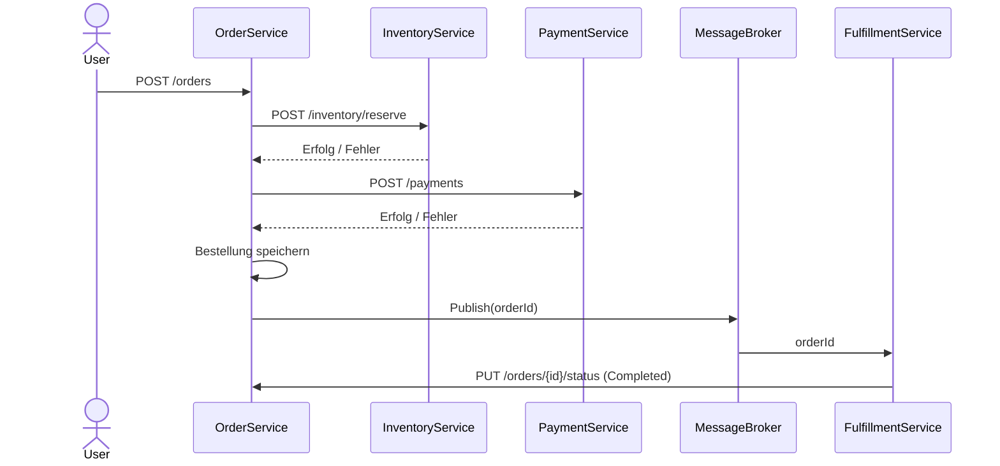
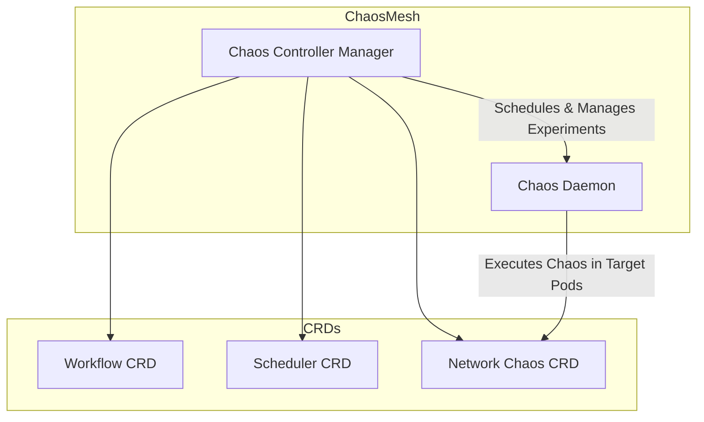
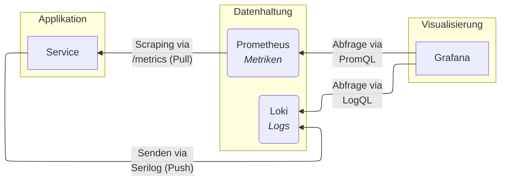
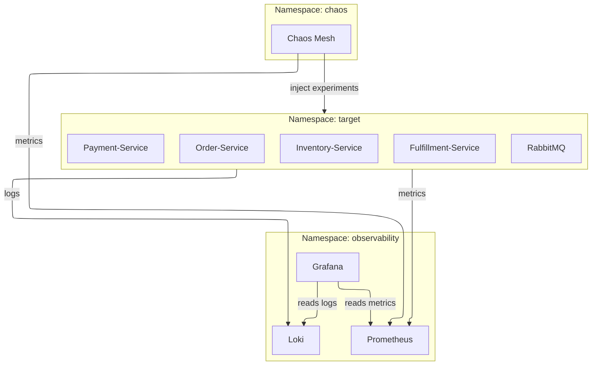
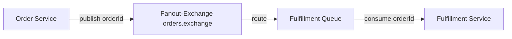

# Proaktives Risikomanagement durch Chaos Engineering: Ein Framework für resiliente Softwarelösungen in Kubernetes

## Abstract

Die Etablierung von Kubernetes als Standard für die Container-Orchestrierung hat neue Ebenen der Komplexität und neuartige Fehlermodi in verteilten Systemen hervorgebracht. Traditionelle Testmethoden erweisen sich häufig als unzureichend, um die Resilienz dieser dynamischen, cloudnativen Architekturen unter realistischen Fehlerbedingungen zu überprüfen. Die vorliegende Arbeit greift diese Herausforderung auf, indem sie ein Framework für proaktives Risikomanagement in Kubernetes konzipiert und implementiert, das auf den Prinzipien des Chaos Engineering basiert. Ziel ist es, eine systematische und empirische Methodik zur Bewertung und Verbesserung der Resilienz von Softwarelösungen bereitzustellen.

Das Framework integriert eine microservicebasierte Referenzanwendung, einen Observability-Stack, der Prometheus und Grafana zur Metrikerfassung und Visualisierung nutzt, sowie Chaos-Mesh zur kontrollierten Injektion von Fehlern. Ein hypothesengesteuerter Ansatz wurde verwendet, um eine Reihe kontrollierter Experimente durchzuführen, darunter Pod-Ausfälle, Netzwerkpartitionen und den Ausfall einer zustandsbehafteten Datenbankkomponente. Das Systemverhalten wurde anhand vordefinierter Service Level Objectives unter Verwendung von Schlüsselmetriken, insbesondere der Four Golden Signals, bewertet.

Die Evaluation demonstrierte die Effektivität des Frameworks bei der Aufdeckung kritischer Schwachstellen. Die Experimente zeigten, dass die Resilienz des Systems durch suboptimale Autoscaling-Konfigurationen, das Fehlen von Fehlertoleranzmustern zur Handhabung synchroner Dienstabhängigkeiten bei Netzwerkausfällen und eine kritische Fehlkonfiguration, die zu Datenverlust in der Persistenzschicht führte, beeinträchtigt wurde. In allen Szenarien wurden signifikante Verletzung der Service Level Objectives beobachtet, was belegt, dass das System realistischen Störungen nicht standhalten konnte.

Letztlich validiert diese Arbeit Chaos Engineering als ein wirksames Instrument des proaktiven Risikomanagements. Das entwickelte Framework bietet einen praktischen und reproduzierbaren Ansatz, um verborgene Schwächen empirisch zu identifizieren, das Systemverhalten unter turbulenten Bedingungen zu validieren und handlungsrelevante Erkenntnisse für die Entwicklung resilienterer, produktionsreifer Anwendungen in Kubernetes-Umgebungen abzuleiten.

# Übersicht
Im folgenden sind verschiedene Diagramme dargestellt, die die Architektur und Komponenten des Systems veranschaulichen.

## 📦 Shop - Sequenzdiagramm des Referenzsystems

## Chaos-Mesh Architektur

## Metric-Flow

## Gesamtarchitektur

## RabbitMQ 

